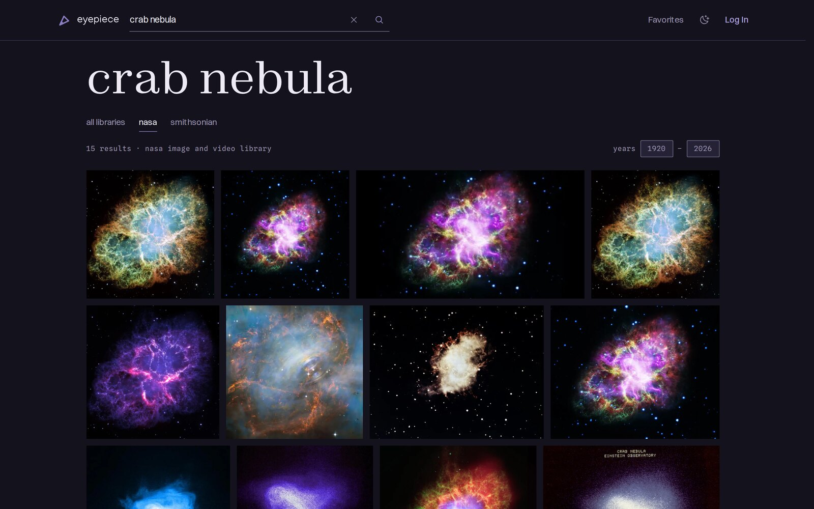
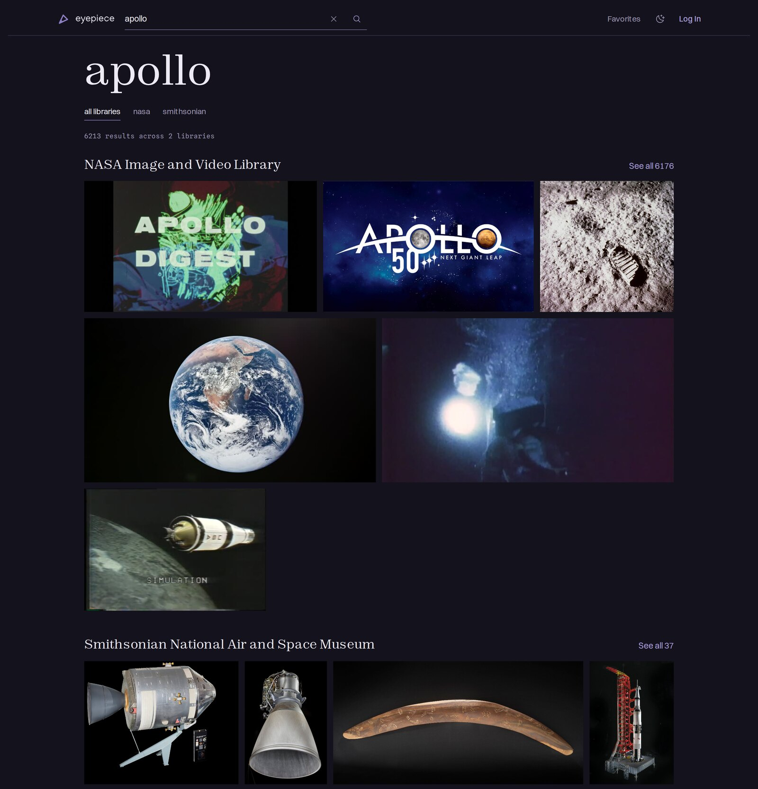

# Eyepiece

Eyepiece is an astronomy image search and collections website built around
the NASA Image and Video Library and the Smithsonian's National Air and Space
Museum collection. Users can search and browse across both providers in one
accessible interface, with filters and metadata tailored to each archive.
Signed-in visitors can save favorites and organize images into public or
private collections.

Opening a result shows its details in an overlay and leaves the search in place
underneath. The address still changes to the asset's own URL. Opening that URL
directly or refreshing it renders the detail as a full page.

Public pages are built to load quickly and stay visually stable. Curated entry
pages are generated ahead of time. Other public routes use cacheable server
rendering, and known image dimensions reserve space before files arrive.

[eyepiece.net](https://eyepiece.net) ·
[Project write-up](https://christopheranderson.net/projects/eyepiece)



## Contents

- [Using Eyepiece](#using-eyepiece)
- [Local development](#local-development)
- [Stack and architecture](#stack-and-architecture)
- [Testing and verification](#testing-and-verification)
- [Project documentation](#project-documentation)
- [Data sources and usage](#data-sources-and-usage)

## Using Eyepiece

Start from the homepage search or one of its curated links. Search All libraries
to browse NASA and Smithsonian at once. Choose one provider to use that
archive's own filters and metadata. The current search and filters are stored in
the URL, which can be bookmarked or shared.



Select an image to open its details. Search results work with a pointer,
touchscreen, or keyboard. The Arrow keys move through the grid. Home, End, Page
Up, and Page Down provide larger jumps. Longer result sets pause at `Load more`
checkpoints, keeping the footer within reach.

Use `Log In` in the site header to sign in or register. Once signed in, the
actions on each image let you add favorites and organize images into public or
private collections. The user menu includes links to Favorites, Your
Collections, View Profile, and Edit Profile. Public collections appear on your
profile, and profile settings control the public display name.

## Local development

### Requirements

- Node.js 24
- pnpm 10.30.3
- a Docker-compatible runtime for local Supabase
- a Smithsonian Open Access API key for live Smithsonian requests (automated
  browser tests use recorded fixtures and do not need the key)

### Setup

```bash
pnpm install
pnpm supabase start

cp .env.example .env.local
cp .env.test.example .env.test
pnpm print-supabase-env
```

Copy the emitted Supabase values into `.env.local` and `.env.test`. Then add an
`SI_OA_API_KEY` to `.env.local`. Sentry is disabled unless its optional values
are configured. See [Environment Variables](docs/EnvironmentVariables.md) for
the full configuration reference.

Install Playwright's shared browser binaries before running end-to-end tests:

```bash
pnpm playwright install
# Linux systems that also need the browser OS packages:
pnpm playwright install --with-deps
```

Start the application:

```bash
pnpm supabase start # if it is not already running
pnpm dev
```

The local database includes a test account:

- email: `user1@example.com`
- password: `hunter2`

### Checks

```bash
pnpm lint
pnpm format
pnpm typecheck
pnpm test:unit
pnpm test:integration # requires local Supabase
pnpm test:e2e         # requires local Supabase
pnpm build
```

`pnpm preflight` runs the complete local gate, including autofixes, all tests,
and the production build.

### Local tooling notes

Panda generates `styled-system/` during installation. Run `pnpm codegen` after
changing `panda.config.ts` or files in `panda/`.

End-to-end tests use `netlify serve` through the repository's package scripts.
The installed Netlify CLI is patched in
[`patches/netlify-cli.patch`](patches/netlify-cli.patch) to prevent repeated
404/403 function invocations and to resolve the correct root from linked Git
worktrees. Use `pnpm serve` rather than a global Netlify installation.

E2E runs may generate a `deno.lock`. The file is ignored because the current
edge function has no external Deno dependencies.

## Stack and architecture

- React 19, TypeScript, and TanStack Start, Router, and Query
- Supabase authentication and Postgres persistence
- Panda CSS with build-time extraction and React Aria Components
- Netlify SSR, prerendering, CDN caching, Image CDN, and an image-source edge
  function
- Vitest, Playwright, Lighthouse, axe-core, and Sentry

Route files define URL and request-policy boundaries. Product behavior lives in
`src/features`, and provider-neutral types live in `src/domain`. External
clients live in `src/integrations`. `src/server/eyepiece` composes the provider
adapters behind one internal service.

Search results use justified rows to preserve image aspect ratios. React Aria
handles grid semantics and focus management. A spatial keyboard delegate follows
the visible row layout.

Public, signed-in, and token-callback route roots each define their authentication
and cache policies. Public server rendering never reads visitor identity.
Personal controls and account data load after hydration. Native and hydrated
forms call the same command layer.

Favorites and collection items store enough provider data to render each saved
asset. A list can load without requesting every item from NASA or Smithsonian
again. If a source record is removed later, the saved entry remains, though
its media can still depend on provider-hosted files.

Supported NASA and Smithsonian image URLs go through Netlify's Image CDN for
responsive AVIF or WebP output. Other URLs use the providers' own renditions. A
small edge function gives NASA source images a longer browser cache policy and a
durable cache across deploys. The homepage and curated entry pages are
prerendered after their database content is provisioned. Other public routes use
cacheable server rendering.

## Testing and verification

Unit tests cover domain rules, parsing, policies, and component behavior.
Integration tests run against a local Supabase instance. Playwright runs the
main workflows in Chromium, Firefox, and WebKit with recorded NASA and
Smithsonian responses. A missing fixture fails the test instead of silently
reaching a live provider.

Audit scripts run Lighthouse and axe against core templates on mobile and
desktop, in both light and dark themes. In the current audit set, every covered
template scored 100 for accessibility and had no axe violations, including the
WCAG 2.2 target-size rule. The audits do not yet cover the public profile,
favorites, or settings pages, and they do not represent real-user experience.

<details>
<summary>August 2026 Lighthouse medians</summary>

| Template          | Performance (mobile / desktop) | Accessibility | Best Practices | SEO |
| ----------------- | ------------------------------ | ------------- | -------------- | --- |
| Home              | 83 / 100                       | 100           | 100            | 100 |
| Search (all)      | 90 / 100                       | 100           | 100            | 66  |
| Search (provider) | 99 / 100                       | 100           | 100            | 66  |
| Asset detail      | 91 / 100                       | 100           | 100            | 100 |
| Collection detail | 88 / 100                       | 100           | 100            | 100 |
| Album             | 98 / 100                       | 100           | 100            | 100 |
| Login             | 100 / 100                      | 100           | 100            | 100 |

Search results are deliberately `noindex`, which accounts for their SEO score.
Mobile performance on image-heavy templates varies with provider image weight
and first-time Image CDN transforms.

</details>

Run the audits with `pnpm audit:lighthouse` and `pnpm audit:axe`.

## Project documentation

- [Architecture decision records](docs/decisions/)
- [Search behavior and URL state](docs/Search.md)
- [Provider model and integration guide](docs/Providers.md)
- [Route, authentication, and caching policy](docs/RoutePolicy.md)
- [Styling conventions](docs/Styling.md)
- [Environment variables](docs/EnvironmentVariables.md)
- [Observability and local Sentry verification](docs/Observability.md)
- [Setting up a separate production site](docs/NewProductionSite.md)

## Data sources and usage

- [NASA Image and Video Library](https://images.nasa.gov/): used under the
  [NASA Images and Media Usage
  Guidelines](https://www.nasa.gov/nasa-brand-center/images-and-media/)
- [Smithsonian Open Access
  API](https://edan.si.edu/openaccess/apidocs/): National Air and Space Museum
  imagery is provided by [Smithsonian Open Access](https://www.si.edu/openaccess).
  Eyepiece filters by [CC0](https://creativecommons.org/publicdomain/zero/1.0/deed.en)
  licensed media.
