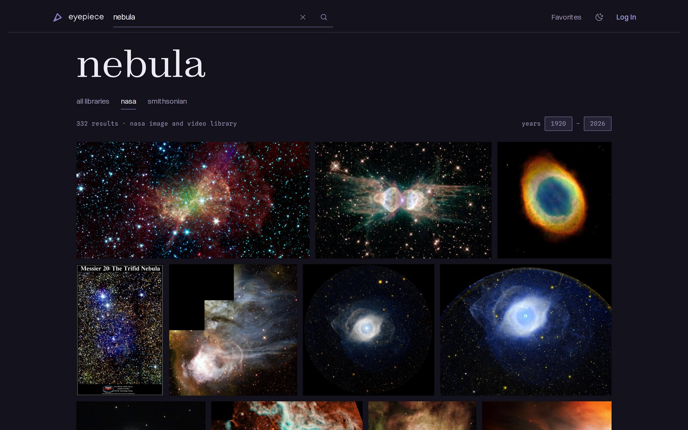

# Eyepiece - Space and Astronomy Image Portal

Eyepiece is a [multi-provider](./docs/Providers.md) image portal. It provides search and favoriting features for multiple open asset providers.



Visit the live site at <https://eyepiece.net>.

Issues to be completed before official launch are listed at [Launch Milestones](https://github.com/christopher-r-anderson/eyepiece/milestone/1).

## Architecture Highlights

Decision records live in [docs/decisions](./docs/decisions), one file per decision, dated when the decision was made.

- [Cache policy follows route audience](./docs/decisions/01-public-caching.md) - the route tree is split into public, private, and token-callback roots that couple cache headers to authentication, with a middleware tripwire that catches a public route reading a session. The [Authentication and Caching](#authentication-and-caching) section below covers the mechanics.
- [Search scopes by provider and defaults to All](./docs/decisions/02-search.md) - one flat query grammar, provider scope tabs, and an all-providers view whose sections stream independently so one slow provider never blocks another.
- [Styles compile at build time with Panda CSS](./docs/decisions/03-styling.md) - the site ported its original Emotion styling to build-time CSS, keeping design tokens as custom properties and dropping the runtime style engine.
- [User lists read snapshots, not the providers](./docs/decisions/04-provider-data.md) - favorites and collections store asset snapshots, so lists render without fanning out to providers, and a weekly job revalidates stale snapshots.
- [Entry pages prerender at build time](./docs/decisions/05-prerendering.md) - the home page and its curated collections are baked in CI after provisioning, so a first visit serves static files instead of waiting on live provider calls.


### Layout Stability

Content that arrives late is not allowed to move content that is already on screen:

- image slots reserve their space from provided dimensions before the file loads
- controls that swap labels (Star and Starred) render both labels in the same grid cell so the control never changes width
- hover and focus reveals animate opacity and position on absolutely positioned layers, outside the normal flow
- fallback fonts are metric-matched to the webfonts (`size-adjust` plus ascent, descent, and line-gap overrides computed from the pinned files), so a swap holds line boxes; glyph widths cannot be matched, so the two first-paint faces load as `font-display: optional` and skip a late swap entirely rather than rewrap
- the hero heading reserves its webfont's line count at narrow widths, so a font arriving after first paint grows into reserved space instead of moving the page

### Performance and Accessibility

The core page templates - home, both search scopes, asset detail, collection detail, album, and login - are audited with Lighthouse (mobile and desktop) and axe-core (light and dark themes, with the WCAG 2.2 target-size rule enabled - axe ships it disabled). The audits run on demand with `pnpm audit:lighthouse` and `pnpm audit:axe`. Production Lighthouse medians as of August 2026, three runs per template and form factor:

| Template          | Perf (mobile / desktop) | Accessibility | Best Practices | SEO |
| ----------------- | ----------------------- | ------------- | -------------- | --- |
| Home              | 83 / 100                | 100           | 100            | 100 |
| Search (all)      | 90 / 100                | 100           | 100            | 66  |
| Search (provider) | 99 / 100                | 100           | 100            | 66  |
| Asset detail      | 91 / 100                | 100           | 100            | 100 |
| Collection detail | 88 / 100                | 100           | 100            | 100 |
| Album             | 98 / 100                | 100           | 100            | 100 |
| Login             | 100 / 100               | 100           | 100            | 100 |

- Accessibility scores 100 on every audited template with zero axe violations. The public profile page and the authenticated pages (favorites and settings) are not yet part of the audited set.
- The SEO 66 on the search templates is an accepted result of search results being `noindex`ed.
- Mobile performance is bound by provider image weight under lab throttling. CLS medians are 0.000 everywhere except asset detail's 0.002-0.016, well inside the good threshold.

## Project Setup

### Local Development

#### Setup

This is the guide for setting up local development for eyepiece.net. If you want to deploy this code to your own site, see [docs/NewProductionSite.md](docs/NewProductionSite.md) first.

```bash
pnpm install
pnpm supabase start # note "Project URL" and "Authentication Keys -> Publishable"

# Set up your local env files by copying the examples and then updating them with your values.
# `.env.local` is used for local app and build configuration.
# `.env.test` is used for test-mode runs like Vitest.
cp .env.example .env.local
cp .env.test.example .env.test

# You can get your local supabase related values to use by running
pnpm print-supabase-env

# `SI_OA_API_KEY` is your Smithsonian Institute Open Access API Key from https://api.data.gov/signup/

# Sentry env vars are optional for local development and tests.
# Leave `VITE_SENTRY_ENABLED=false` unless you are intentionally verifying the Sentry integration.
# See "Local Development" in `docs/EnvironmentVariables.md` for further details.

# To be able to run e2e tests, use one of the following:
# Note that this is over 400MB of downloads, though they will be shared with other local projects that use the same versions
pnpm playwright install
# If you are on Linux and do not already have playwright OS dependencies installed, use this instead
pnpm playwright install --with-deps
```

#### Running Locally

```bash
pnpm supabase start # if not already started
pnpm dev
```

Note that the Netlify CLI is patched ([patches/netlify-cli.patch](patches/netlify-cli.patch)) to avoid excessive local and CI 404 resolutions ([Netlify discussion](https://answers.netlify.com/t/netlify-is-invoking-404-functions-4-extra-times/127098)), so run it through the package scripts (`pnpm netlify`, `pnpm serve`) rather than a global install. The same patch also fixes project-root detection from git worktrees ([netlify/cli#7868](https://github.com/netlify/cli/issues/7868)) — the stock CLI builds and serves the parent checkout's code when `pnpm serve` runs from a worktree nested inside the repository; `pnpm dev` is unaffected.

Styling is generated by Panda CSS. If `styled-system/` is missing or stale — after editing `panda.config.ts` or files in `panda/` — rebuild it with `pnpm codegen` (it is also rebuilt on every `pnpm install`).

### Observability

Eyepiece uses Sentry for client-side and server-side observability.

- Client-side observability is initialized from the router and includes route-aware tracing and Replay when enabled.
- Server-side observability is initialized from the server entry and captures request and server-function failures through shared middleware.
- Shared error observability rules keep expected errors, such as handled form errors and 400 responses, out of Sentry.
- When a user is signed in, both client and server events are associated with the authenticated user id.

For the main integration points and development guidance, see [docs/Observability.md](docs/Observability.md).

#### Local Observability Verification

To verify the Sentry integration locally:

1. Set `VITE_SENTRY_ENABLED=true` and provide a valid `VITE_SENTRY_DSN` in `.env.local`.
2. Start the app with `pnpm dev` and visit `/dev/observability`.
3. Confirm that the client render error reaches Sentry with route and boundary metadata.
4. Confirm that handled form errors remain visible in the UI but do not show up in Sentry.
5. Use the full-reload server-error control and confirm that the request is captured on the server.
6. Confirm that the handled 400 response renders in the boundary UI but does not show up in Sentry.
7. If you are signed in locally, confirm client-side and server-side events are associated with the authenticated user id.

#### Site authentication

There will be an existing user you can log in to the local site with:

- email: `user1@example.com`
- password: `hunter2`

#### Pre-commit Checklist

- `pnpm lint` runs `eslint`
- `pnpm format` runs `prettier`
- `pnpm typecheck` runs `tsc`
- `pnpm test:unit` runs `vitest run --project unit` (use `pnpm test:unit:watch` for watch mode while developing)
- `pnpm test:integration` runs `vitest --project integration` (integration tests against local Supabase require `pnpm supabase start`)
- `pnpm test:e2e` runs `playwright test` (e2e tests against local Supabase require `pnpm supabase start`)

You can use `pnpm fix` instead of `pnpm lint` and `pnpm format` to run them both and autofix any issues found (when possible).

E2E tests may generate a `deno.lock` file the first time because the `netlify` cli is used to serve the project. This file can be safely deleted since the project does not use edge functions. If they are used in the future, remove the entry from `.gitignore` and track the file.

### New Production Site

If you would like to set up a new production site using this codebase or just wish to understand the setup, you can refer to the [New production site setup](docs/NewProductionSite.md) guide.

## Authentication and Caching

Eyepiece uses a three-root route tree that enforces authentication requirements and cache policy at the boundary level:

- **Public routes** (`/(public)/`) are unauthenticated. Server-side rendering never branches on user identity, so responses are CDN-cacheable by default. User-specific UI is rendered as client-only islands after hydration.
- **Private routes** (`/(private)/`) require an authenticated session and always respond with `private, no-store`.
- **Token-callback routes** (`/(token-callbacks)/`) handle sensitive one-time tokens (email confirmation, password reset, OAuth returns). No session is established on load, so responses are `private, no-store` and never cached.

Cache policy and authentication enforcement are applied at each root and inherited by all descendants. Route files in each subtree cannot override policy, set raw `Cache-Control` headers, or access the user Supabase client outside the authenticated scope.

For the full policy reference, including route classes, guard behavior, cache profiles, and client auth commands, see [docs/RoutePolicy.md](docs/RoutePolicy.md).

## Providers

Eyepiece supports multiple image asset providers.

### Current Providers

#### NASA Image and Video Library

- [NASA API portal](https://api.nasa.gov/) NASA Image and Video Library
- [NASA IVL API Documentation (PDF)](https://images.nasa.gov/docs/images.nasa.gov_api_docs.pdf)
- Used with permission under the [NASA Images and Media Usage Guidelines](https://www.nasa.gov/nasa-brand-center/images-and-media/)

#### The Smithsonian Institution Open Access - National Air and Space Museum

- [The Smithsonian Institution Open Access API](https://edan.si.edu/openaccess/apidocs/)
- Used with permission under [The Smithsonian Institution Terms of Use](https://www.si.edu/termsofuse)
- Imagery is dedicated to the public domain (CC0) through [Smithsonian Open Access](https://www.si.edu/openaccess)

### Provider Integration

To understand the provider integration points or how to add a new provider, see the documentation in the [Providers Guide](./docs/Providers.md).
